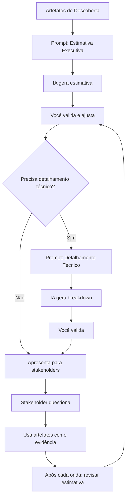

# Guia Prático: Estimativas de Modernização

> **Pergunta do stakeholder**: "Quando fica pronto?"  
> **Resposta errada**: "3 meses" (chute sem justificativa)  
> **Resposta certa**: Estimativa estruturada com cenários e riscos

---

## 🎯 Princípio Fundamental

**Dev não deve só estimar — deve explicar o porquê da estimativa.**

Isso muda completamente a percepção do stakeholder e reduz pressão.

---

## 📋 Pré-Requisitos

Antes de estimar, você deve ter:

- ✅ `architecture-context.md` - contexto arquitetural
- ✅ `functional-map.md` - mapa funcional
- ✅ `modernization-backlog.md` - backlog estruturado
- ✅ `modernization-roadmap.md` - roadmap incremental

Se não tiver, execute primeiro o [GUIA-PRATICO.md](GUIA-PRATICO.md).

---

## 🚀 Premissa: Uso de IA na Implementação

Este guia **assume que o time utilizará ferramentas de IA** (Claude Code, Cursor, Copilot, etc.) durante a implementação.

### Impacto Realista da IA no Prazo

**Onde IA acelera significativamente** (1.5x a 2x):
- ✅ Geração de código boilerplate
- ✅ Criação de testes unitários
- ✅ Refatorações estruturais
- ✅ Migração de código entre versões/frameworks
- ✅ Implementação de observabilidade (logs, métricas)
- ✅ Documentação de código
- ✅ Debug e troubleshooting

**Onde IA NÃO acelera**:
- ⏱️ Aprovações organizacionais
- ⏱️ Dependências externas (infra, outras equipes)
- ⏱️ Reuniões e alinhamentos
- ⏱️ Descoberta de regras de negócio ocultas
- ⏱️ Testes manuais/validação funcional
- ⏱️ Deploy e rollout
- ⏱️ Code review e aprovação de PR

### Fator de Aceleração Esperado

**Aceleração média geral**: 25-35% do tempo total

Por quê não mais?
- Apenas ~60% do trabalho é codificação pura
- Restante: aprovações, reuniões, descobertas, validações

**NÃO assuma**:
- ❌ 10x de aceleração (irreal)
- ❌ IA resolve tudo sozinha
- ❌ Eliminação de code review
- ❌ Eliminação de testes manuais

### Como IA Muda o Roadmap

**Com IA, você pode**:
- ✅ Adicionar mais testes (antes "não tínhamos tempo")
- ✅ Fazer refatorações mais profundas
- ✅ Modernizar mais módulos no mesmo período
- ✅ Implementar observabilidade completa
- ✅ Documentar melhor o código

**Estratégia muda**:
- Menos "quick wins superficiais"
- Mais "melhorias estruturais profundas"
- Priorizar qualidade, não só velocidade

---

## 🤖 Ferramenta Recomendada

**Melhor escolha**: Claude (Code/Chat/Opus)

✅ Por quê?
- Melhor estruturação de texto
- Melhor argumentação
- Melhor equilíbrio técnico + explicação

❌ **Não usar**:
- GitHub Copilot - não é bom em narrativa/explicação

---

## 🚫 Anti-Pattern: O que NÃO fazer

```
❌ Prompt errado:
"Me diga quanto tempo leva para modernizar este sistema?"

Resultado:
→ Chute sofisticado
→ Sem justificativa
→ Difícil de defender em reunião
```

---

## ✅ Fluxo Correto

```
1. Contexto → Usar artefatos da descoberta
2. Plano técnico → IA gera breakdown detalhado
3. Validação → Você ajusta/refina
4. Estimativa estruturada → IA gera cenários
5. Tradução para negócio → IA formata para stakeholders
```

---

## 📝 Prompt Copy-Paste

### Etapa 1: Estimativa Executiva (Para Stakeholders)

```markdown
Você é um Engineering Manager sênior com experiência em estimativas de modernização de sistemas legados.

**Contexto do projeto**:

Temos os seguintes artefatos de descoberta do sistema legado:

<colar aqui: architecture-context.md>

<colar aqui: functional-map.md>

<colar aqui: modernization-backlog.md>

<colar aqui: modernization-roadmap.md>

**Informações adicionais**:
- Tamanho do time: [X devs]
- Disponibilidade: [% de dedicação ao projeto]
- Ferramentas de IA que serão usadas: [Claude Code, Cursor, etc.]
- Restrições: [lista restrições conhecidas]
- Prioridade organizacional: [Alta|Média|Baixa]

**Premissa de implementação**:
O time utilizará ferramentas de IA para acelerar a implementação.
Considere os seguintes fatores de aceleração realistas:

- Código e refatoração: 1.5x a 2x mais rápido
- Testes unitários: 1.8x a 2x mais rápido
- Observabilidade e instrumentação: 2x mais rápido
- Documentação: 2x mais rápido
- Aprovações, reuniões, dependências externas: SEM aceleração
- **Aceleração média geral: 25-35% do tempo total**

**Tarefa**:

Gerar uma resposta executiva para stakeholders não técnicos sobre o prazo de modernização.

A resposta deve conter:

## 📌 Resumo Executivo

[Resumo em 2-3 frases do que será feito, SEM jargão técnico]

## ⚙️ Principais Entregas

| Entrega | Descrição | Impacto | Complexidade |
|---------|-----------|---------|--------------|
| [nome]  | [o que é] | [benefício] | [Baixa\|Média\|Alta] |

## ⏱️ Estimativa de Prazo

**Cenário Otimista**: [X semanas/meses]
- Premissas: [listar premissas]
- Aceleração por IA já considerada: ~35%

**Cenário Realista** ⭐ (recomendado): [Y semanas/meses]
- Premissas: [listar premissas]
- Aceleração por IA já considerada: ~30%

**Cenário Pessimista**: [Z semanas/meses]
- Premissas: [listar premissas]
- Aceleração por IA já considerada: ~25%

**Nota importante**: 
Estes prazos já consideram o uso de ferramentas de IA para acelerar 
codificação, testes e refatorações. Aprovações, dependências externas 
e reuniões não são aceleradas por IA.

## 📊 Distribuição do Esforço

| Fase | Duração Estimada | Objetivo | Onde IA mais ajuda |
|------|------------------|----------|-------------------|
| Wave 1 - Estabilização | [X sprints] | [objetivo] | Testes automatizados, observabilidade |
| Wave 2 - Desacoplamento | [Y sprints] | [objetivo] | Extração de interfaces, refatorações |
| Wave 3 - Modernização | [Z sprints] | [objetivo] | Migração de framework, reescrita |
| **Total** | **[Total sprints]** | | |

**Como IA muda o roadmap por fase**:

**Wave 1 (Estabilização)**: ~30% aceleração
- IA gera testes automatizados rapidamente
- Implementa observabilidade completa (antes "não dava tempo")
- Refatora código legado para testabilidade

**Wave 2 (Desacoplamento)**: ~35% aceleração
- Extrai interfaces automaticamente
- Cria adapters/facades
- Migra código entre módulos com segurança

**Wave 3 (Modernização)**: ~40% aceleração
- Migra entre frameworks (maior impacto da IA)
- Reescreve componentes mantendo lógica
- Atualiza dependências com menos risco

## ⚠️ Riscos que Podem Impactar Prazo

**Alto Impacto**:
1. [Risco 1] - pode adicionar [tempo] ao prazo
2. [Risco 2] - pode adicionar [tempo] ao prazo

**Médio Impacto**:
1. [Risco 3]
2. [Risco 4]

**Riscos relacionados ao uso de IA**:
1. Ferramentas de IA indisponíveis/instáveis - pode reduzir aceleração esperada
2. Código gerado sem validação adequada - pode gerar débito técnico

## 🔗 Dependências Externas

**Bloqueantes**:
- [Dependência 1] - necessário em [quando]
- [Dependência 2] - necessário em [quando]

**Facilitadoras**:
- [Dependência 3] - acelera [o que]

## 🎯 Marcos Principais

**M1**: [Nome] - Semana [X]  
**M2**: [Nome] - Semana [Y]  
**M3**: [Nome] - Semana [Z]  
**M4**: Migração completa - Semana [W]

## 💡 Recomendações

1. [Recomendação para acelerar/reduzir risco]
2. [Recomendação para viabilidade]
3. [Recomendação para governança]

## 📈 Estratégia de Entrega

[Explicar se vai ser big bang, incremental, strangler fig, etc. em linguagem simples]

---

**Importante**:
- Use linguagem de negócio, não técnica
- Justifique cada estimativa
- Deixe claro o que pode impactar prazo
- Seja transparente sobre incertezas
- Foque em valor, não em tecnologia
```

---

### Etapa 2: Detalhamento Técnico (Para o Time)

```markdown
Agora gere um documento técnico complementar para uso interno do time de desenvolvimento.

**Contexto**: mesmos artefatos anteriores

**Tarefa**:

Gerar um documento técnico detalhado seguindo a estrutura:

# Detalhamento Técnico da Estimativa

## Premissas Técnicas

**Capacidade do time**:
- Devs disponíveis: [X]
- Velocity médio: [Y story points/sprint] (se conhecido)
- Duração do sprint: [Z semanas]

**Restrições técnicas**:
- [Lista de restrições]

**Dependências técnicas**:
- [Lista de dependências]

## Breakdown por Epic

### [EPIC-XXX] Nome do Epic

**Histórias**:

| ID | História | Complexidade | Estimativa | Dependências | Riscos |
|----|----------|--------------|------------|--------------|--------|
| STORY-001 | [nome] | M | [pontos/dias] | [lista] | [lista] |
| STORY-002 | [nome] | S | [pontos/dias] | [lista] | [lista] |

**Total Epic**: [X pontos/dias]

**Riscos técnicos**:
1. [Risco específico] - impacto: [alto/médio/baixo]

**Mitigação**:
- [Estratégia de mitigação]

---

## Estimativa por Wave

### Wave 1: Estabilização
- Sprints: [X]
- Story points total: [Y]
- Histórias: [Z]
- Riscos principais: [lista]

### Wave 2: Desacoplamento
[mesma estrutura]

### Wave 3: Modernização
[mesma estrutura]

## Análise de Complexidade

**Alto risco/alta complexidade**:
- [STORY-XXX] - motivo: [explicação]

**Médio risco**:
- [Lista]

**Baixo risco (quick wins)**:
- [Lista]

## Suposições da Estimativa

**O que foi assumido**:
1. [Suposição 1]
2. [Suposição 2]

**O que pode invalidar a estimativa**:
1. [Cenário que muda tudo]
2. [Outro cenário]

## Estratégia de Validação

**Como reduzir incerteza**:
1. [Spike técnico] - [quando fazer]
2. [PoC] - [quando fazer]
3. [Validação com especialista] - [quando fazer]

## Refinamento Contínuo

**Checkpoints de revisão**:
- Após Wave 1: reavaliar [o que]
- Após Wave 2: reavaliar [o que]

---

**Importante**:
- Detalhamento técnico é para o time, não para stakeholders
- Inclua justificativas técnicas
- Seja transparente sobre incertezas
- Documente premissas
```

---

## 📊 Exemplo de Resposta Final

### Para Stakeholders (Resumo)

```
📌 Resumo Executivo

A modernização envolve estabilização do sistema atual, desacoplamento 
de integrações críticas e migração incremental para nova arquitetura. 
O processo será gradual para garantir continuidade operacional.

O time utilizará ferramentas de IA (Claude Code, Cursor) para acelerar 
codificação, testes e refatorações.

⏱️ Estimativa de Prazo

**Cenário Otimista**: 3 meses (12-14 sprints)
- Premissa: time de 3 devs com 80% de dedicação
- Premissa: aprovações de infra em até 1 semana
- Premissa: acesso a especialistas quando necessário
- Aceleração por IA já considerada: ~35%

**Cenário Realista** ⭐: 4-4.5 meses (16-20 sprints)
- Mesmas premissas acima
- Aceleração por IA já considerada: ~30%
- Considera descobertas inesperadas e ajustes

**Cenário Pessimista**: 5.5-6 meses (22-26 sprints)
- Premissa: descoberta de complexidade não mapeada
- Premissa: dependências externas com atrasos
- Aceleração por IA já considerada: ~25%

⚠️ Riscos que Podem Impactar Prazo

1. Integração com sistema externo sem documentação - pode adicionar 2-3 semanas
2. Descoberta de regras de negócio não mapeadas - pode adicionar 1-2 semanas
3. Indisponibilidade de ambiente de homologação - pode adicionar 1 semana
4. Ferramentas de IA indisponíveis - pode adicionar 10-15% ao prazo

🎯 Marcos Principais

M1: Observabilidade implantada - Semana 3
M2: Integração crítica desacoplada - Semana 8
M3: Runtime modernizado - Semana 12
M4: Migração completa - Semana 16-20

💡 Como IA acelera este roadmap

✅ Geração de testes automatizados (50% mais rápido)
✅ Refatoração de código legado (40% mais rápido)
✅ Implementação de observabilidade (35% mais rápido)
✅ Migração entre frameworks (40% mais rápido)

⏱️ Tarefas que consomem tempo mesmo com IA

- Aprovações organizacionais
- Reuniões e alinhamentos
- Dependências de infra/outras equipes
- Validação de regras de negócio com especialistas
- Deploy e homologação

**Nota**: Prazos já consideram uso de IA. Aceleração está embutida nos cenários.
```

---

## ✅ Checklist de Qualidade da Estimativa

Sua estimativa está boa se:

- [ ] Tem 3 cenários (otimista/realista/pessimista)
- [ ] Lista premissas explicitamente
- [ ] Identifica riscos com impacto quantificado
- [ ] Mapeia dependências externas
- [ ] Usa linguagem de negócio para stakeholders
- [ ] Tem detalhamento técnico separado para o time
- [ ] Justifica cada número apresentado
- [ ] Deixa claro o que pode mudar a estimativa

---

## 🎓 Dicas Importantes

### 1. Separe Audiências

**Para stakeholders**:
- ✅ Foco em valor e risco
- ✅ Linguagem de negócio
- ✅ Cenários e marcos
- ❌ Detalhes técnicos
- ❌ Jargão

**Para o time**:
- ✅ Breakdown técnico
- ✅ Complexidade por história
- ✅ Riscos técnicos
- ✅ Estratégias de mitigação

### 2. Use os Artefatos como Evidência

Quando questionado sobre a estimativa:

```
"Como você chegou nesse prazo?"

Resposta:
"Baseado na descoberta arquitetural, identificamos X integrações
críticas. Pelo mapa funcional, são Y fluxos de negócio impactados.
O backlog tem Z histórias de desacoplamento necessárias antes 
da migração. Usamos IA para acelerar codificação (~30-35%), mas 
aprovações e dependências externas não aceleram."
```

👉 **Você tem evidências**, não chutes.

### 3. Explique Como IA Está Embutida

Stakeholders podem perguntar: "Isso já considera uso de IA?"

Resposta clara:
```
"Sim, os prazos já consideram que usaremos Claude Code/Cursor 
para acelerar codificação, testes e refatorações em ~30%. 
Mas aprovações, reuniões e dependências externas consomem 
o mesmo tempo, por isso a aceleração geral é de 25-35%, 
não 50% ou mais."
```

### 4. Mantenha Transparência sobre Incerteza

**Não diga**: "Vai levar 3 meses"  
**Diga**: "Cenário realista é 3-4 meses, assumindo [premissas]. 
Se [risco X] acontecer, pode chegar a 5 meses."

### 5. Revise a Estimativa Continuamente

```
Após cada onda:
1. Validar premissas
2. Reavaliar riscos
3. Ajustar cenários
4. Comunicar mudanças
5. Validar se aceleração por IA está sendo atingida
```

### 6. Stakeholder Quer Saber

**NÃO quer**:
- Código
- Framework
- Arquitetura técnica

**QUER**:
- Previsibilidade
- Risco
- Impacto
- Quando pode mostrar valor

---

## ⚠️ Limitações da Estimativa Gerada por IA

A IA pode:
- ❌ Subestimar complexidade humana (aprovações, alinhamentos)
- ❌ Não conhecer contexto organizacional específico
- ❌ Assumir disponibilidade ideal do time
- ❌ Não considerar trabalho paralelo/interrupções
- ❌ Superestimar aceleração em tarefas que exigem muito contexto

**Sempre ajuste a estimativa com**:
- ✅ Conhecimento real do contexto organizacional
- ✅ Histórico de velocity do time (se existir)
- ✅ Restrições conhecidas não documentadas
- ✅ Experiência com ferramentas de IA sendo usadas

---

## 🔄 Fluxo Recomendado



---

## 📈 Resultado Esperado

Com este guia, você consegue:

✅ Estimativas realistas com IA embutida  
✅ Justificativa clara de prazos  
✅ Transparência sobre onde IA acelera (e onde não)  
✅ Redução de pressão e retrabalho  
✅ Melhora percepção de senioridade  
✅ Confiança dos stakeholders  
✅ Facilita negociação de escopo/prazo  
✅ Expectativas corretas sobre uso de IA  

---

## 📚 Referências

- [Apêndice J](../docs/Apêndice_J__Estimativas_e_Comunicação_com_Negócio.md) - Teoria de estimativas e comunicação
- [GUIA-PRATICO.md](GUIA-PRATICO.md) - Como gerar os artefatos de descoberta
- [orchestration.md](orchestration.md) - Filosofia do processo de modernização

---

**Versão**: 0.1  
**Última atualização**: 2026-05-28
